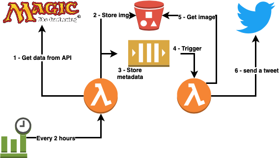

# AWS MTG Twitter Bot

A Magic the Gathering twitter bot based on AWS resources

## Description

This project is a Twitter Bot based on AWS resources that will publish tweets 
about the Magic trading card game. 

This project is only made for fun and it's an opportunity to play with Twitter 
API.

You can see the result here: https://twitter.com/BotMTGCards

## Architecture



## Deployment

### Prerequisites

Before launching Terraform you need to download Python dependencies. So 
please read the README file under layer/python/lib/python3.7/site-packages 
before going ahead.

**Please fill the terraform.tfvars file with your Twitter credentials**

### Terraform deployment

After dependencies downloaded, you can deploy the whole solution by using 
Terraform.

```bash
$ terraform init
$ terraform plan
$ terraform apply
```
## LICENSE

This project is released under MIT license.